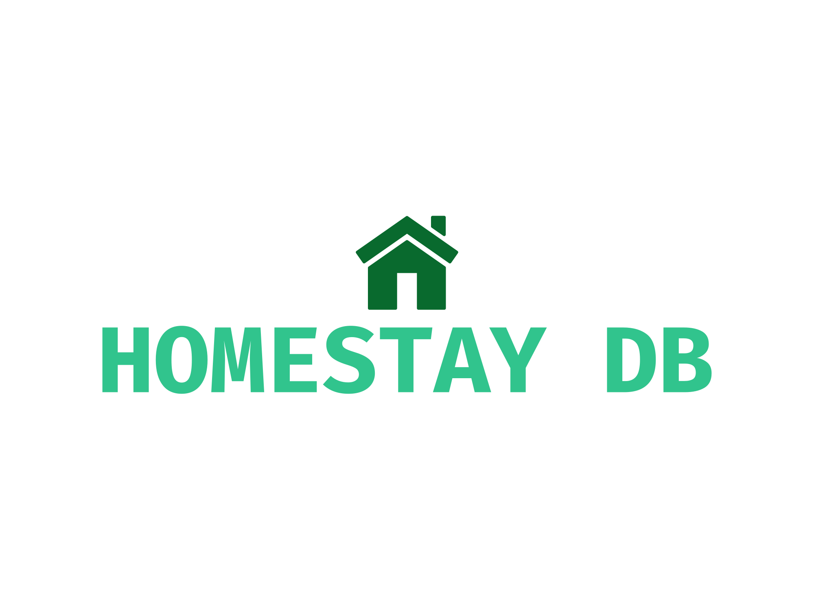

# Homestay Company Database Project

This repository contains the database design and implementation for a homestay company that facilitates accommodation for international students in Canada. The company acts as an intermediary between Canadian families offering rooms and international students seeking short-term stays.

## Project Overview

The primary goal of this project is to create a comprehensive and efficient database system that effectively manages all aspects of the homestay company's operations, including family information, student details, house specifications, contracts, reviews, and more.

## Client Description

The homestay company specializes in arranging accommodations for international students visiting Canada. The company connects Canadian families willing to host students with international students seeking temporary stays. The database system is designed to store and manage the following information:

- **Families Information**: Includes details such as first name, last name, occupation, date of birth, gender, family size, a short family bio, and spoken languages.

- **Student Information**: Encompasses student first name, last name, date of birth, nationality, gender, hobbies, and interests.

- **House Information**: Provides information about the house, including the number of rooms, available homestay rooms, accommodations, smoking and pet policies, and the address.

- **Room Information**: Describes each available room's size in square feet, availability dates, and room price.

- **Contracts**: Stores contract details between families and students, including contract duration, student and family names, and other relevant information.

- **School Information**: Stores data about the school a student is attending and the duration of their studies.

- **Reviews**: Enables students and families to write comments about their experiences. Review details include the date of the comment, review points (number of stars), and the comment text.

## Project Components

The project consists of several components:

1. **ER Modeling Diagram**: Utilizing the Chen notation, an Entity-Relationship (ER) diagram was created to visualize the database's structure. The diagram provides a clear representation of how entities are related and what attributes they possess.

2. **ER-Model Mapping to Database Relational Schema**: A SQL script is provided in the repository to create the necessary tables based on the ER modeling diagram. This script forms the foundation of the database's structure.

3. **Normalization Document**: The normalization process ensures the database's reliability and minimizes data redundancy. The provided document explains the steps taken to normalize the database schema to conform to First Normal Form (1NF), Second Normal Form (2NF), Third Normal Form (3NF), and Boyce-Codd Normal Form (BCNF).

4. **Test Data**: A set of test data has been added to populate the database and facilitate testing and demonstration of the database system's functionality.

5. **Queries and Views**: The project includes SQL queries and views that cater to the client's requirements. These queries and views are designed to retrieve relevant information from the database to aid in decision-making and analysis.

## How to Use

1. Clone this repository to your local environment.

2. Execute the SQL script provided in the "createTable.sql" file to create the database schema.

3. Optionally, populate the database with the provided test data using the appropriate SQL statements.

4. Use the queries and views provided in the repository to retrieve specific information from the database according to the client's requirements.

## Conclusion

The Homestay Company Database Project showcases a comprehensive and well-organized approach to managing the operations of a homestay company. Through ER modeling, normalization, and the implementation of SQL queries and views, the database system effectively supports the company's objectives of connecting Canadian families and international students while maintaining accurate and accessible records.
